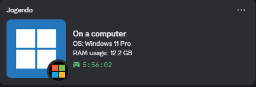

# 💻 OS Discord RPC

Um Rich Presence customizado para Discord desenvolvido em **TypeScript** e **Node.js**, que detecta e exibe automaticamente informações em tempo real sobre seu sistema operacional, arquitetura, modelo de hardware e consumo de memória RAM no seu perfil do Discord.

## ✨ Funcionalidades

- 🪟 **Multiplataforma**: Suporte dedicado para **Windows**, **macOS** e **Linux**.
- 📊 **Informações Detalhadas**:
  - Nome do Sistema Operacional e Distribuição.
  - Versão e Arquitetura do SO (x64, arm64, etc.).
  - Modelo do dispositivo e chip do processador (no macOS).
  - Consumo de memória RAM calculado e atualizado em tempo real.
- ⏱️ **Tempo de Atividade (Uptime)**: Exibe há quanto tempo o computador está ligado.
- 🔄 **Atualização Contínua**: Intervalo de atualização inteligente a cada 15 segundos.

---

## Atenção, por ser um projeto para uso pessoal, foram utilizados 3 dispositivos diferentes para a testes do Rich Presence:
- ### Desktop Windows 11 Pro

- ### Macbook Air M4 

- ### Notebook Linux Mint 

### Se você utilizar um hardware ou sistema diferente destes dispositivos, pode ser que o Rich Presence não funcione corretamente, pois o código foi desenvolvido e testado especificamente para esses dispositivos. Para isso, você precisará alterar o código para que funcione corretamente no seu dispositivo.

---

## 📸 Exemplos de Rich Presence que ficarão no seu perfil do Discord:

### Windows 11 Pro


- Exibe informações como:
  - Sistema Operacional e Versão:
  - Arquitetura: 
  - Consumo de Memória RAM: 
  - Tempo de Atividade (calculado em tempo real a partir do boot do sistema):

### macOS


- Exibe informações como:
  - Sistema Operacional e Versão:
  - Arquitetura
  - Modelo do dispositivo e chip do processador:
  - Consumo de Memória RAM: 
  - Tempo de Atividade (calculado em tempo real a partir do boot do sistema):

### Linux (Imagem desatualizada)


- Exibe informações como:
  - Nome e versão da distribuição: 
  - Arquitetura: 
  - Consumo de Memória RAM: 
  - Tempo de Atividade (calculado em tempo real a partir do boot do sistema):

---

## 🚀 Como Configurar e Usar

### 1. Criar e Configurar a Aplicação no Discord Developer Portal

1. Acesse o [Discord Developer Portal](https://discord.com/developers/applications) e faça login com sua conta do Discord.
2. Clique no botão **"New Application"** no canto superior direito.
3. Dê um nome para a aplicação (ex: `Operating System` ou o nome que desejar que apareça como status do jogo/aplicativo) e confirme.
4. Na aba **General Information**, copie o **Application ID** (App ID).
5. Vá até a aba **Rich Presence** > **Art Assets**:
   - Faça o upload das imagens que quiser usar como logos no Rich Presence. As seguintes chaves (**Asset Names**) que foram utilizadas neste projeto são:
     - `windows`: Logo principal do Windows.
     - `microsoft`: Logo secundário da Microsoft.
     - `apple_m4`: Logo principal da Apple / Apple Silicon.
     - `apple`: Logo secundário da Apple.
     - `linux_mint`: Logo principal da distribuição Linux.
     - `terminal`: Logo secundário do terminal.
   - Clique em **Save Changes**.

---

### 2. Clonar e Instalar o Projeto

Certifique-se de ter o **Node.js** (versão 18+ recomendada) e o **Git** instalados.

1. Clone este repositório ou baixe os arquivos:
   ```bash
   git clone https://github.com/seu-usuario/my-custom-discord-rpc.git
   cd my-custom-discord-rpc
   ```

2. Instale as dependências:
   ```bash
   npm install
   ```

---

### 3. Configurar as Variáveis de Ambiente

1. Crie um arquivo `.env` na raiz do projeto (ou renomeie o `.env.example` para `.env`):
   ```bash
   cp .env.example .env
   ```

2. Abra o arquivo `.env` e insira o seu `APP_ID` obtido no portal de desenvolvedores do Discord:
   ```env
   # Exemplo de APP_ID
   APP_ID=123456789012345678
   ```

---

### 4. Executar o Projeto

Certifique-se de que o aplicativo desktop do **Discord está aberto** no seu computador.

Execute o comando:
```bash
npm start
```

O comando irá compilar o código TypeScript (`tsc`) e iniciar a aplicação Node.js. Se tudo estiver correto, você verá no terminal:
```text
Logged in as seu_usuario_discord
```
O status no seu perfil do Discord será atualizado automaticamente!

---

## 🛠️ Explicação Técnica

### 1. Comunicação via IPC (Inter-Process Communication)
O projeto utiliza a biblioteca oficial `discord-rpc` configurada com o transporte `ipc` (`new DiscordRPC.Client({ transport: "ipc" })`).
- Diferente de bots comuns do Discord que utilizam WebSockets e tokens de bot, o Rich Presence para usuários locais se comunica diretamente com o cliente desktop do Discord em execução na sua máquina através de um socket IPC / Named Pipe local (`\\.\pipe\discord-ipc-0` no Windows ou `/tmp/discord-ipc-0` no Unix).

### 2. Detecção e Coleta de Informações do Sistema
O código avalia o sistema atual através de `os.platform()` e executa a rotina apropriada:

- **Windows (`win32`)**:
  - `os.version()`: Obtém a edição do Windows (ex: *Windows 11 Pro*).
  - `os.release()`: Obtém o build do kernel (ex: *10.0.26200*).
  - `os.arch()`: Obtém a arquitetura do processador (ex: *x64*).
- **macOS (`darwin`)**:
  - `sw_vers`: Coleta nome e versão do produto macOS.
  - `system_profiler SPHardwareDataType`: Extrai o modelo do Mac (ex: *Mac mini*, *MacBook Pro*) e o processador Apple Silicon (ex: *Apple M4*).
- **Linux (`linux`)**:
  - `/etc/os-release`: Lê a variável `PRETTY_NAME` para extrair a distribuição exata (ex: *Linux Mint 21*, *Ubuntu 24.04 LTS*).

### 3. Cálculo Dinâmico de Memória RAM
A cada ciclo de execução da função `setActivity()`, os métodos nativos `os.totalmem()` e `os.freemem()` calculam em tempo real a quantidade de memória usada:
$$\text{RAM Usada (GB)} = \frac{\text{totalmem} - \text{freemem}}{1024^3}$$

### 4. Ciclo de Atualização e Rate Limits
- A função `setActivity()` é executada imediatamente após o evento `ready` do cliente Discord.
- Em seguida, um temporizador `setInterval(setActivity, 15000)` atualiza o status a cada **15 segundos**.
- Esse intervalo respeita as diretrizes de rate limit do Discord RPC, garantindo fluidez na atualização do consumo de RAM sem sobrecarregar a API nem a máquina.

---
